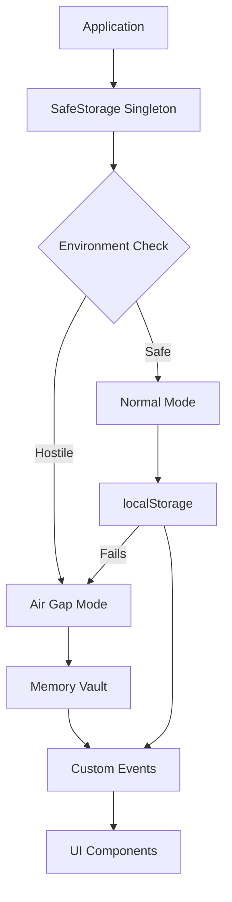

# Design Document

## Overview

The Safe Storage System will be refactored from a JavaScript class to a strict TypeScript singleton class that provides resilient data storage capabilities. The system will maintain the existing "Air Gap" logic while adding type safety for all storage operations and cryptographic payload handling. The singleton pattern ensures consistent storage behavior across the entire application.

## Architecture

The system follows a defensive programming approach with automatic fallback mechanisms:



## Components and Interfaces

### Core Interfaces

```typescript
interface StorageItem {
  key: string;
  value: string;
  timestamp: number;
}

interface SentinelStorageEvent extends StorageEvent {
  key: string;
  newValue: string | null;
  oldValue?: string | null;
  storageArea: Storage | null;
  url: string;
  isAirGapped: boolean;
}

interface VaultPayload {
  data: string;
  encrypted: boolean;
  checksum?: string;
}

interface SafeStorageConfig {
  probeKey: string;
  enableLogging: boolean;
  maxMemoryItems: number;
}
```

### SafeStorage Singleton Class

```typescript
class SafeStorage {
  private static instance: SafeStorage;
  private memoryStore: Map<string, string>;
  private isAirGapped: boolean;
  private config: SafeStorageConfig;
  
  private constructor(config?: Partial<SafeStorageConfig>);
  public static getInstance(config?: Partial<SafeStorageConfig>): SafeStorage;
  
  // Core storage operations
  public setItem(key: string, value: string): void;
  public getItem(key: string): string | null;
  public removeItem(key: string): void;
  
  // Status and diagnostics
  public getAirGapStatus(): boolean;
  public getStorageStats(): StorageStats;
  
  // Private methods
  private testStorage(): void;
  private switchToAirGapMode(): void;
  private dispatchStorageEvent(key: string, newValue: string | null): void;
  private dispatchAirGapAlert(): void;
}
```

## Data Models

### Storage Statistics

```typescript
interface StorageStats {
  isAirGapped: boolean;
  memoryItemCount: number;
  localStorageAvailable: boolean;
  lastProbeTime: number;
  totalOperations: number;
  failedOperations: number;
}
```

### Configuration Model

```typescript
interface SafeStorageConfig {
  probeKey: string;           // Key used for storage probing
  enableLogging: boolean;     // Enable console logging
  maxMemoryItems: number;     // Maximum items in memory vault
}
```

## Correctness Properties

*A property is a characteristic or behavior that should hold true across all valid executions of a system-essentially, a formal statement about what the system should do. Properties serve as the bridge between human-readable specifications and machine-verifiable correctness guarantees.*

### Property Reflection

After analyzing all acceptance criteria, several properties can be consolidated to eliminate redundancy:

- Properties 1.1-1.4 can be combined into a comprehensive initialization property
- Properties 2.1-2.3 can be combined into a storage operation property
- Properties 3.1-3.4 can be combined into a retrieval operation property
- Properties 4.1-4.4 can be combined into a removal operation property
- Properties 5.1-5.5 can be combined into an event dispatching property
- Properties 6.1-6.5 can be combined into a status management property

### Core Properties

**Property 1: Singleton initialization and environment detection**
*For any* SafeStorage instance creation, the system should always return the same singleton instance, perform storage probing, and set the correct air-gap mode based on localStorage availability
**Validates: Requirements 1.1, 1.2, 1.3, 1.4**

**Property 2: Storage operation resilience**
*For any* key-value pair, storing data should succeed either in localStorage (normal mode) or memory vault (air-gap mode), with automatic fallback when localStorage operations fail during runtime
**Validates: Requirements 2.1, 2.2, 2.3**

**Property 3: Event dispatching consistency**
*For any* successful storage operation, the system should dispatch a custom StorageEvent with correct properties (key, value, storageArea, URL) and dispatch air-gap alerts when mode changes occur
**Validates: Requirements 2.4, 2.5, 5.1, 5.2, 5.3, 5.4, 5.5**

**Property 4: Data retrieval consistency**
*For any* storage key, retrieval should return the correct value from the appropriate storage location (localStorage or memory vault) with consistent null returns for non-existent data
**Validates: Requirements 3.1, 3.2, 3.3, 3.4**

**Property 5: Data removal effectiveness**
*For any* stored key, removal operations should successfully delete the data from the appropriate storage location and ensure subsequent retrieval returns null
**Validates: Requirements 4.1, 4.2, 4.3, 4.4**

**Property 6: Air-gap status accuracy**
*For any* system state, the air-gap status should accurately reflect the current storage mode and be immediately updated when storage hostility is detected
**Validates: Requirements 6.1, 6.2, 6.3, 6.4, 6.5**

**Property 7: Memory management integrity**
*For any* memory vault operations, the system should properly manage Map entries, maintain data consistency during mode transitions, and handle concurrent operations safely
**Validates: Requirements 7.1, 7.2, 7.3, 7.4**

<function_calls>
<invoke name="prework">
<parameter name="featureName">safe-storage-system

## Error Handling

### Storage Failure Scenarios

1. **Safari Private Mode Detection**: Automatic detection during initialization with immediate air-gap activation
2. **Runtime Quota Exhaustion**: Graceful degradation with event notification and mode switching
3. **localStorage Access Denial**: Fallback to memory vault with maintained functionality
4. **Memory Constraints**: Configurable limits with optional cleanup strategies

### Error Recovery Strategies

```typescript
enum StorageErrorType {
  QUOTA_EXCEEDED = 'quota_exceeded',
  ACCESS_DENIED = 'access_denied',
  STORAGE_DISABLED = 'storage_disabled',
  UNKNOWN_ERROR = 'unknown_error'
}

interface StorageError {
  type: StorageErrorType;
  message: string;
  recoveryAction: 'air_gap' | 'retry' | 'fail';
  timestamp: number;
}
```

### Defensive Programming Patterns

- **Probe-First Strategy**: Always test storage before relying on it
- **Graceful Degradation**: Maintain functionality even when preferred storage fails
- **Event-Driven Notifications**: Inform components of storage state changes
- **Type Safety**: Strict TypeScript interfaces prevent runtime type errors

## Testing Strategy

### Dual Testing Approach

The testing strategy combines unit tests for specific scenarios with property-based tests for comprehensive coverage:

**Unit Tests**:
- Specific examples of storage operations in different modes
- Edge cases like empty keys, null values, and special characters
- Error conditions and recovery scenarios
- Event dispatching verification
- Singleton pattern enforcement

**Property-Based Tests**:
- Universal properties across all storage operations
- Comprehensive input coverage through randomization
- Minimum 100 iterations per property test
- Each test tagged with: **Feature: safe-storage-system, Property {number}: {property_text}**

### Testing Framework Configuration

**Framework**: Jest with @fast-check/jest for property-based testing
**Configuration**:
- Property tests: minimum 100 iterations
- Timeout: 10 seconds for property tests
- Coverage: 95% line coverage requirement
- Type checking: strict TypeScript compilation

### Test Environment Setup

```typescript
// Mock localStorage for testing different scenarios
interface MockStorage {
  store: Map<string, string>;
  quotaExceeded: boolean;
  accessDenied: boolean;
}

// Test utilities for simulating hostile environments
class StorageTestUtils {
  static simulateQuotaExceeded(): void;
  static simulateSafariPrivateMode(): void;
  static simulateNormalEnvironment(): void;
  static createMockStorage(config: MockStorage): Storage;
}
```

### Property Test Examples

Each correctness property will be implemented as a property-based test:

```typescript
// Example property test structure
describe('SafeStorage Property Tests', () => {
  test('Property 1: Singleton initialization', () => {
    fc.assert(fc.property(
      fc.record({ enableLogging: fc.boolean() }),
      (config) => {
        const instance1 = SafeStorage.getInstance(config);
        const instance2 = SafeStorage.getInstance();
        expect(instance1).toBe(instance2);
      }
    ), { numRuns: 100 });
  });
});
```

## Implementation Notes

### Migration Strategy

1. **Phase 1**: Create TypeScript interfaces and types
2. **Phase 2**: Implement singleton SafeStorage class
3. **Phase 3**: Add comprehensive error handling
4. **Phase 4**: Implement property-based tests
5. **Phase 5**: Update existing code to use new API

### Breaking Changes

- Constructor becomes private (singleton pattern)
- Static getInstance() method required for access
- Stricter type checking may reveal existing type issues
- Event interface changes require updates to event listeners

### Backward Compatibility

- Maintain same public API surface (setItem, getItem, removeItem)
- Preserve existing event dispatching behavior
- Keep air-gap detection logic identical
- Ensure same storage fallback behavior